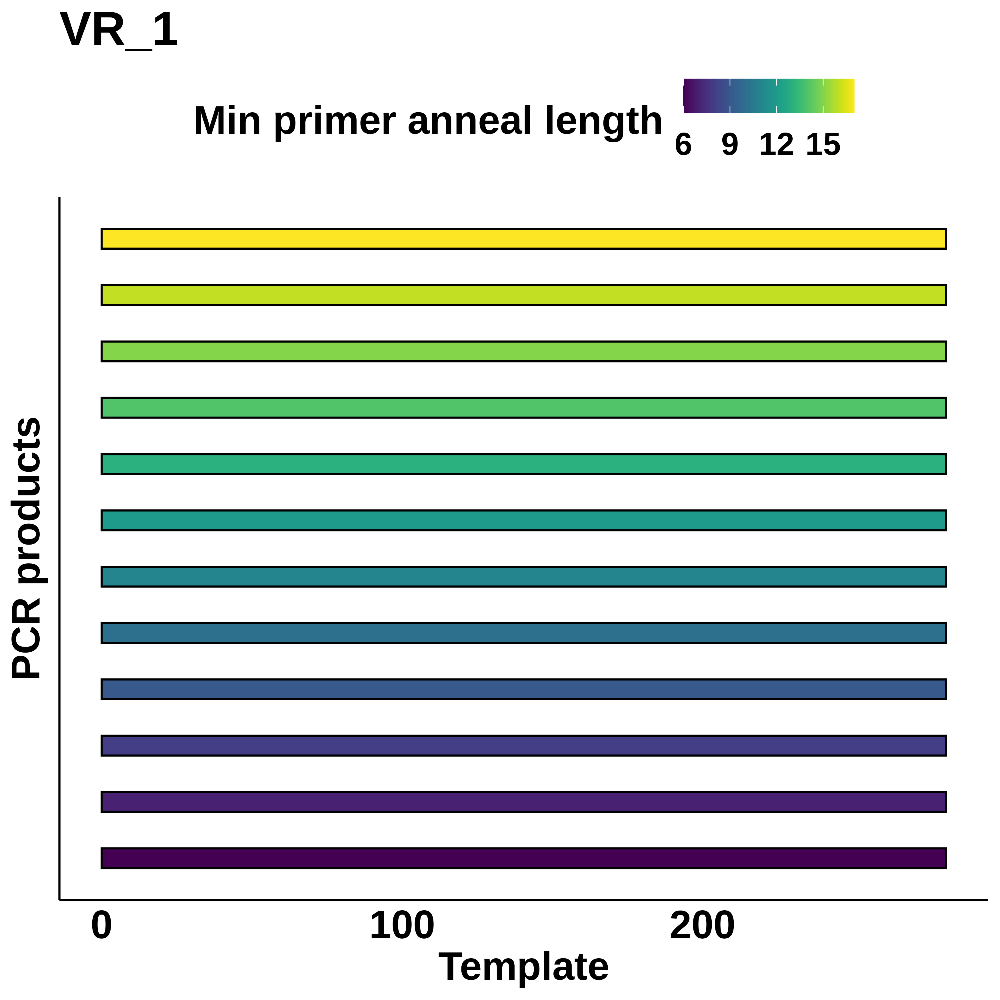

# VR-insert-PCR-sim

Simulate PCR reactions for different primers and templates. Visualize the
resulting products with ggplot.

## Input

Place a fasta formatted file containing primer sequences in the `input/primers`
directory. Place fasta formatted files each containing one template sequence
into the `input/templates` directory. Run the pipeline using `snakemake` or
by configuring `run.sh` for your system.

## Output

For each template and set of primer's the workflow will product a plot showing
PCR products produced from each template at various levels of annealing
stringency (number of nucleotides of primer that must anneal to template in order to produce a product). An example plot is shown below.

